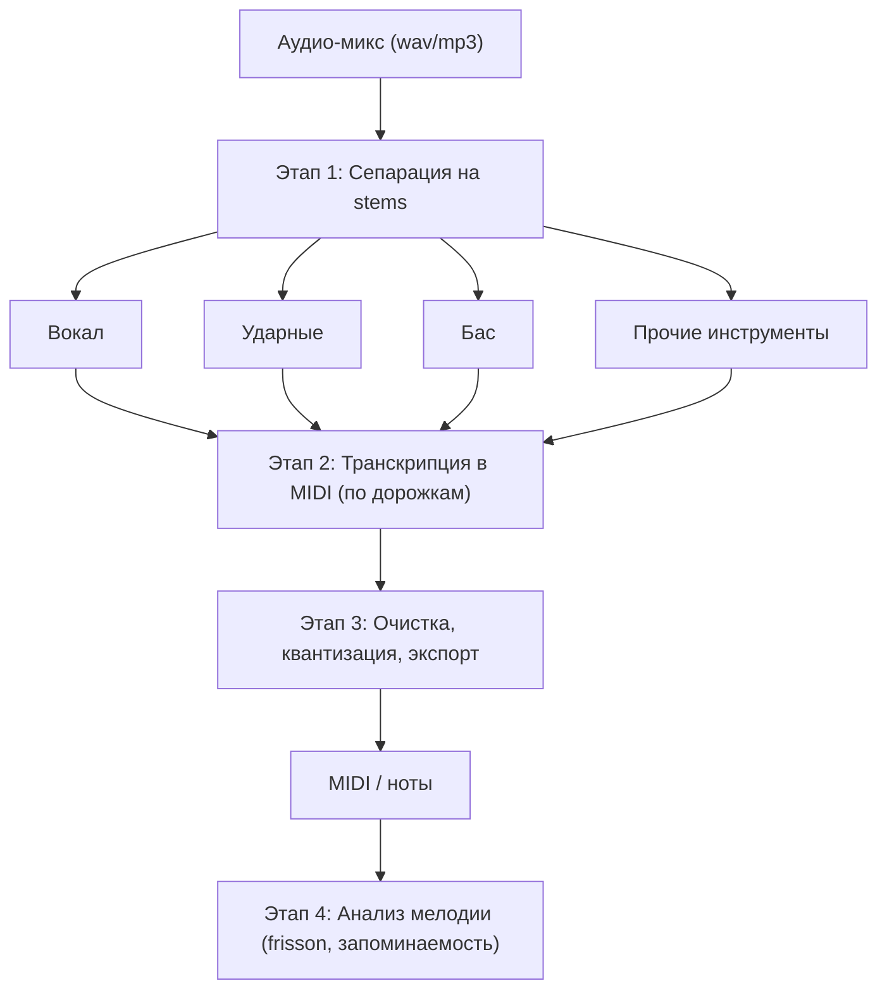

# Гибридный пайплайн: сепарация → транскрипция → очистка

## Обзор

## Этап 1 — Сепарация

| Решение | Подход | Заметки |
|---|---|---|
| [facebookresearch/demucs](https://github.com/facebookresearch/demucs) | htdemucs (Hybrid Transformer) | ~9 dB SDR, сильный baseline, локально |
| [deezer/spleeter](https://github.com/deezer/spleeter) | 2/4/5 stems | быстрый, но слабее современных |
| [MVSep](https://mvsep.com/) | BS/MelBand Roformer, Demucs4 HT | веб, лучшее качество на сегодня |

## Этап 2 — Транскрипция в MIDI

| Решение | Назначение | Ссылка |
|---|---|---|
| YourMT3+ | мультиинструментальная | https://github.com/mimbres/YourMT3 |
| Transkun | фортепиано (высокая точность) | https://github.com/yujia-yan/transkun |
| D3RM (diffusion) | фортепиано, SOTA-направление | https://arxiv.org/abs/2501.05068 |
| ROSVOT | вокальная мелодия | https://github.com/RickyL-2000/ROSVOT |
| spotify/basic-pitch | быстрый черновик, любой инструмент | https://github.com/spotify/basic-pitch |
| MR-MT3 | улучшенный MT3 | https://arxiv.org/abs/2403.10024 |

## Этап 3 — Очистка

- Квантизация ритма, удаление ложных нот, склейка.
- Инструменты: Songscription (https://www.songscription.ai/), Klangio (https://klang.io/), DAW.

## Важная оговорка

Полностью точной end-to-end транскрипции ансамбля пока не существует (нехватка данных, плотная полифония). Гибридный подход — компромисс, дающий лучший практический результат сегодня.

## Роль Suno

Suno (через [sunoapi.org](https://docs.sunoapi.org/suno-api/separate-vocals-from-music)) покрывает **только Этап 1** — выдаёт аудио-stems, **не MIDI**, и только для треков, сгенерированных в Suno. Для транскрипции в ноты всё равно нужен Этап 2.
